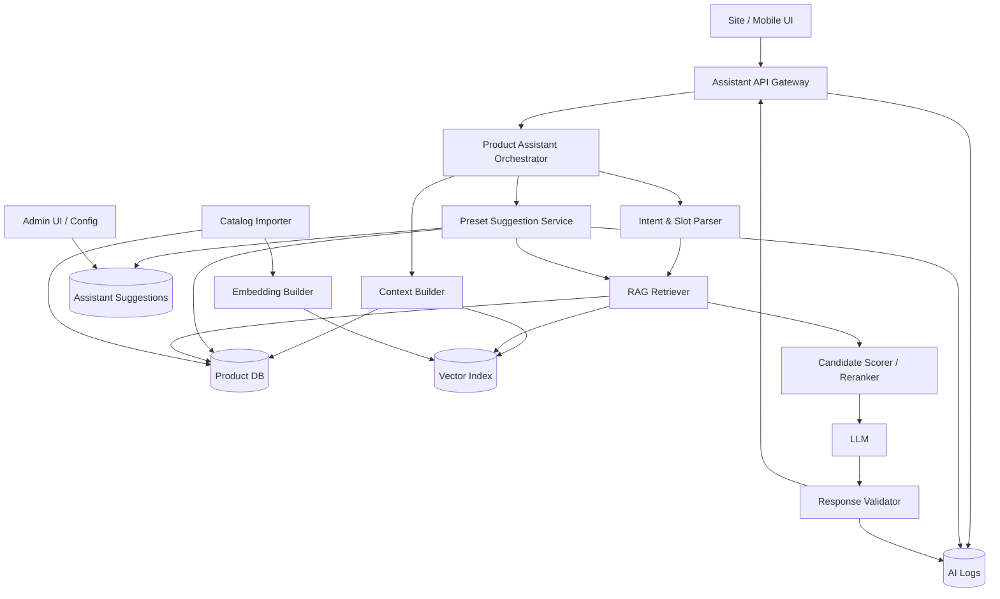
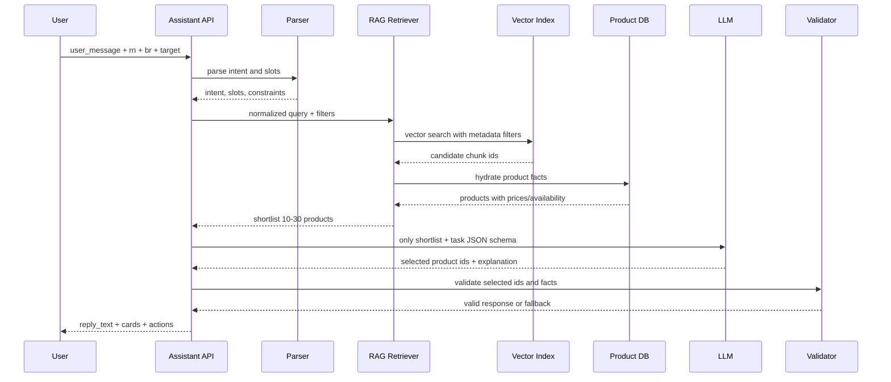
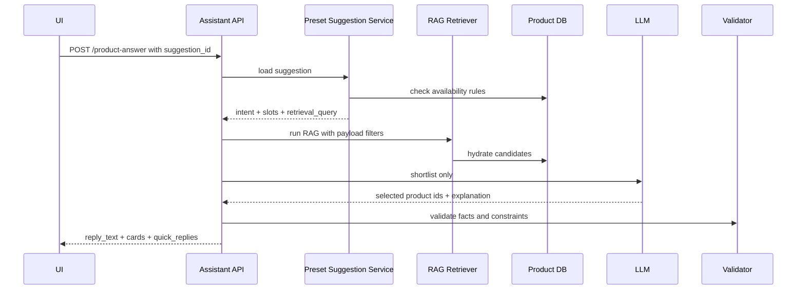

# Technical Design Document: AI-помощник для товаров

**Версия:** 1.1  

**Дата:** 2026-06-26  

**Статус:** Draft  

**Назначение:** технический дизайн прототипа AI-помощника, который отвечает только на вопросы по товарам и помогает пользователю выбрать товары из актуального каталога.

**Изменения v1.1:** добавлен функциональный блок преднастроенных подсказок для клиента: структура сценариев, правила показа, связь с RAG, API, админское управление, fallback и аналитика.

---

## 1. Контекст и цель

AI-помощник работает как отдельный backend-сервис, к которому сайт или приложение обращаются по API. Прототип должен помогать пользователю по товарным сценариям:

- подобрать товар или несколько товаров по запросу;

- ответить на вопрос о составе, цене, весе, КБЖУ, аллергенах и характеристиках товара;

- сравнить товары;

- подобрать товары по категории, бюджету, вкусу, ингредиентам и ограничениям;

- вернуть интерфейсу структурированный ответ: текст, карточки товаров, быстрые кнопки и действия.

Ключевой принцип: LLM не является источником фактов. Названия, цены, составы, КБЖУ, изображения, доступность и городовая привязка берутся из локальной базы, которая наполняется импортом из API каталога. LLM используется для понимания запроса, ранжирования shortlist-кандидатов, объяснения выбора и генерации короткого ответа.

---

## 2. Scope прототипа

### 2.1. In scope

1. Ответы только по товарам:

   - состав;

   - цена;

   - вес;

   - КБЖУ, если есть в API/базе;

   - аллергены, если есть в API/базе;

   - наличие/доступность в городе;

   - рекомендации по товарам;

   - сравнение товаров;

   - подбор по бюджету, вкусу, ингредиентам и категории.

2. Импорт городов из API.

3. Импорт товаров из API по торговой сети, городу и платформе.

4. Локальное хранение нормализованного каталога.

5. RAG по товарам:

   - подготовка текстового представления товара;

   - построение embeddings;

   - vector search + metadata filters;

   - shortlist для LLM.

6. Преднастроенные подсказки для клиента как быстрые сценарии подбора товаров.

7. Управление подсказками через конфигурацию/админку.

8. Валидация ответов LLM.

9. Логирование запросов, кандидатов, ответов и ошибок.

10. Простые fallback-ответы без LLM.

### 2.2. Out of scope

1. История заказов клиента.

2. Персонализация на основе заказов.

3. Статус заказа, повтор заказа, отмена заказа.

4. Профиль клиента, адреса, телефон, бонусы, промокоды клиента.

5. Вопросы по доставке и оплате, кроме fallback-сообщения «я отвечаю только по товарам».

6. CRM, операторская панель, Telegram-бот как отдельные каналы.

7. Генерация персональных подсказок на основе истории заказов.

8. Автоматическое создание новых подсказок LLM без модерации администратора.

9. A/B-тесты, продвинутая аналитика, ML-рекомендации похожих пользователей.

---

## 3. Основные принципы дизайна

1. **Товары не придумываются.** LLM может выбирать только из переданного списка `candidates`.

2. **Факты только из базы.** Цена, состав, КБЖУ, вес, фото, доступность и город берутся из локальной БД, синхронизированной с API.

3. **Городовая доступность до LLM.** Фильтр по `br`/городу применяется перед векторным поиском и перед LLM.

4. **RAG вместо передачи всего каталога.** В LLM отправляются только релевантные chunks/товары и краткие metadata.

5. **Нет истории заказов.** В запросах, хранилище и prompt-ах прототипа нет данных о прошлых заказах пользователя.

6. **Жесткие ограничения фильтруются кодом.** Аллергены, исключенные ингредиенты, город, наличие и цена не доверяются LLM.

7. **После LLM всегда работает валидатор.** Он проверяет JSON, `product_id`, доступность, факты и запрещенные утверждения.

8. **Подсказки не являются свободным prompt-ом.** Каждая подсказка хранит структурированный payload с intent, slots и правилами показа.

9. **Ответ всегда структурированный.** UI получает текст, карточки, быстрые действия и машинно-читаемые причины.

---

## 4. High-level architecture



---

## 5. Компоненты

### 5.1. Assistant API Gateway

Отвечает за внешний HTTP API прототипа:

- принимает запросы от сайта/приложения;

- валидирует обязательные поля;

- нормализует канал, город, платформу;

- возвращает единый JSON-ответ;

- пишет технические логи;

- не хранит историю заказов.

### 5.2. Product Assistant Orchestrator

Основной координатор сценария:

1. получает запрос;

2. вызывает parser интентов и слотов;

3. собирает контекст города/каталога;

4. запускает RAG retrieval;

5. формирует shortlist;

6. вызывает LLM для ранжирования/объяснения, если это нужно;

7. валидирует результат;

8. возвращает финальный ответ.

### 5.3. Intent & Slot Parser

Извлекает намерение и ограничения пользователя.

Поддерживаемые интенты прототипа:

| Intent | Пример | Действие |

|---|---|---|

| `product_recommendation` | «Подбери сет до 1500» | RAG + scoring + LLM rerank |

| `product_question` | «Что входит в Филадельфию?» | Поиск товара + ответ фактами |

| `product_compare` | «Чем отличается Филадельфия от Калифорнии?» | Найти товары и сравнить поля |

| `product_filter` | «Покажи роллы без креветки» | Фильтры + выдача карточек |

| `nutrition_question` | «Сколько калорий?» | Ответ по КБЖУ, если поле есть |

| `allergen_question` | «Есть ли креветка?» | Проверка состава/аллергенов |

| `unsupported` | «Где мой заказ?» | Fallback: только товарные вопросы |

Слоты:

```json

{

  "intent": "product_recommendation",

  "slots": {

    "city_id": "guid-br",

    "target": "WEB",

    "category": "set",

    "budget_max": 1500,

    "preferred_ingredients": ["лосось"],

    "excluded_ingredients": ["креветка"],

    "taste": ["нежный"],

    "spicy": false,

    "people_count": 2,

    "product_mentions": []

  },

  "need_clarification": false,

  "confidence": 0.89

}

```

Гибридный подход:

- правилами извлекаются числа, бюджет, «без X», «острое/не острое», город, категория;

- fuzzy search используется для названий товаров;

- LLM используется для сложных формулировок: «что-нибудь легкое», «сытное на двоих», «не люблю жирное».

### 5.4. Catalog DB

Локальная база является источником фактов для помощника. Она обновляется importer-ом из API.

### 5.5. RAG Retriever

RAG-компонент ищет релевантные товары по смыслу и фильтрам.

Функции:

- строит поисковый запрос из `normalized_text` и слотов;

- применяет metadata filters: `rn`, `br`, `target`, `is_available`, `category`, `price`, `excluded_ingredients`, `allergens`;

- выполняет hybrid search: keyword + vector;

- возвращает 10–30 кандидатов для scoring/LLM.

### 5.6. LLM Adapter

Изолирует работу с моделью:

- версионирует prompts;

- задает JSON schema ответа;

- контролирует timeout/retry;

- обрезает контекст;

- не передает полный каталог;

- не передает историю заказов.

### 5.7. Response Validator

Проверяет любой ответ LLM до отправки пользователю:

- JSON валиден;

- все `product_id` существуют;

- товары доступны в текущем `br`;

- товары относятся к текущему `rn` и `target`;

- цена, состав, вес, КБЖУ не отличаются от базы;

- нет товаров вне shortlist;

- нет нарушений пользовательских ограничений;

- нет обещаний абсолютной безопасности при аллергии;

- текст не содержит запрещенных фраз;

- количество карточек не превышает лимит.

### 5.8. Preset Suggestion Service

Отвечает за преднастроенные подсказки, которые клиент видит как быстрые сценарии выбора товаров.

Задачи компонента:

- получить список активных подсказок для текущих `rn`, `br`, `target` и экрана;

- проверить, что под подсказку есть доступные товары в текущем городе;

- скрыть подсказки, которые ведут к пустой выдаче;

- преобразовать клик по подсказке в `intent` и `slots`;

- передать structured payload в общий RAG pipeline;

- записать события показа, клика, пустой выдачи и конверсии.

Важно: текст подсказки не должен напрямую отправляться в LLM как свободная инструкция. Сервис использует заранее заданный `payload`, а LLM получает только shortlist валидных товаров.

### 5.9. Admin Configuration Service

Минимальная админская конфигурация для прототипа:

- включение/отключение подсказок;

- порядок отображения;

- текст и emoji;

- городовая доступность;

- категории, теги, ингредиенты и бюджет;

- сезонность/период активности;

- fallback-тексты;

- запрещенные фразы и лимиты ответа.

---

## 6. Импорт городов и товаров согласно API

### 6.1. Параметры API

| Параметр | Значение |

|---|---|

| `rn` | GUID торговой сети |

| `br` | GUID города / business region |

| `target` | Платформа: `WEB` для сайта, `MOBILE` для приложения |

| `withArchive` | `false` — прайслист конкретного города; `true` — общая коллекция продуктов |

Для прототипа основной режим импорта товаров: `target=WEB`, `withArchive=false`, потому что помощник должен отвечать по актуальному прайслисту конкретного города.

### 6.2. External API endpoints

#### Города

```http

GET [https://venus-api-backend2.apps-web.net/v1/cities?rn={rn}](https://venus-api-backend2.apps-web.net/v1/cities?rn={rn})

```

Пример из предоставленного API:

```http

GET [https://venus-api-backend2.apps-web.net/v1/cities?rn=A79C5050-1EE7-11EB-9B6E-05B5FC40DF2A](https://venus-api-backend2.apps-web.net/v1/cities?rn=A79C5050-1EE7-11EB-9B6E-05B5FC40DF2A)

```

#### Один продукт

```http

GET [https://venus-api-catalog2.apps-web.net/v1/products/{product_id}?rn={rn}&br={br}&target=WEB&withArchive=false](https://venus-api-catalog2.apps-web.net/v1/products/{product_id}?rn={rn}&br={br}&target=WEB&withArchive=false)

```

#### Продукты по категории

```http

GET [https://venus-api-catalog2.apps-web.net/v1/products?rn={rn}&br={br}&target=WEB&cat={category_id}](https://venus-api-catalog2.apps-web.net/v1/products?rn={rn}&br={br}&target=WEB&cat={category_id})

```

Если API поддерживает `withArchive` для этого endpoint-а, прототип должен явно передавать:

```http

GET [https://venus-api-catalog2.apps-web.net/v1/products?rn={rn}&br={br}&target=WEB&cat={category_id}&withArchive=false](https://venus-api-catalog2.apps-web.net/v1/products?rn={rn}&br={br}&target=WEB&cat={category_id}&withArchive=false)

```

#### Список продуктов по id

```http

POST [https://venus-api-catalog2.apps-web.net/v1/products/?rn={rn}&br={br}&target=WEB](https://venus-api-catalog2.apps-web.net/v1/products/?rn={rn}&br={br}&target=WEB)

Content-Type: application/json

```

Body:

```json

{

  "ids": [

    "11168F2A-DF47-4366-A362-5EBF06FCA6D6"

  ]

}

```

### 6.3. Import jobs

#### 6.3.1. City import job

Назначение: синхронизировать список городов для торговой сети.

Алгоритм:

1. Получить `rn` из конфигурации.

2. Вызвать `GET /v1/cities?rn={rn}`.

3. Нормализовать ответ:

   - `external_city_id` / `br`;

   - название города;

   - статус активности, если есть;

   - служебные поля API, если нужны для последующих запросов.

4. Upsert в таблицу `cities`.

5. Зафиксировать результат в `import_jobs`.

Периодичность:

- вручную через admin/internal endpoint;

- автоматически 1 раз в сутки;

- перед полным импортом товаров.

#### 6.3.2. Product import job

Назначение: синхронизировать товары по каждому активному городу.

Алгоритм полного импорта:

1. Загрузить активные города из `cities`.

2. Для каждого города взять `br`.

3. Для каждого настроенного `category_id` вызвать products-by-category API.

4. Для каждого товара выполнить нормализацию.

5. Upsert в `products` и `city_products`.

6. Пометить отсутствующие в новом импорте товары как `is_available=false` для конкретного города.

7. Сформировать/обновить `searchable_text`.

8. Поставить товары в очередь на embedding rebuild.

9. Записать статистику импорта.

Периодичность:

- базово каждые 15–60 минут для прайса/наличия;

- полный импорт 1 раз в сутки;

- ручной запуск для отладки.

#### 6.3.3. Incremental product import by ids

Используется, когда известны измененные `product_id`.

Алгоритм:

1. Получить список ids.

2. Для каждого активного `br` вызвать POST products-by-ids.

3. Обновить `products`, `city_products`, `product_chunks`, embeddings.

### 6.4. Import error handling

| Ошибка | Поведение |

|---|---|

| API timeout | Retry с exponential backoff |

| 5xx | Retry, затем job status `partial_failed` |

| 4xx | Не retry, записать ошибку конфигурации |

| Пустой список товаров по городу | Не удалять старые товары сразу; пометить job как suspicious |

| Некорректная цена/состав | Товар не участвует в рекомендациях, status `invalid` |

| Embedding build failed | Товар остается доступен для keyword search, но не для vector search |

---

## 7. Data model

### 7.1. `retail_networks`

```sql

CREATE TABLE retail_networks (

    id UUID PRIMARY KEY,

    rn UUID NOT NULL UNIQUE,

    name TEXT NOT NULL,

    is_active BOOLEAN NOT NULL DEFAULT TRUE,

    created_at TIMESTAMP NOT NULL DEFAULT now(),

    updated_at TIMESTAMP NOT NULL DEFAULT now()

);

```

### 7.2. `cities`

```sql

CREATE TABLE cities (

    id UUID PRIMARY KEY,

    rn UUID NOT NULL,

    br UUID NOT NULL,

    name TEXT NOT NULL,

    is_active BOOLEAN NOT NULL DEFAULT TRUE,

    raw_payload JSONB,

    imported_at TIMESTAMP NOT NULL,

    UNIQUE (rn, br)

);

```

### 7.3. `products`

Глобальная карточка товара без городовой цены/доступности.

```sql

CREATE TABLE products (

    id UUID PRIMARY KEY,

    rn UUID NOT NULL,

    external_product_id UUID NOT NULL,

    name TEXT NOT NULL,

    category_id TEXT,

    category_name TEXT,

    description TEXT,

    ingredients JSONB,

    allergens JSONB,

    tags JSONB,

    weight NUMERIC,

    pieces INT,

    calories NUMERIC,

    protein NUMERIC,

    fat NUMERIC,

    carbs NUMERIC,

    image_url TEXT,

    raw_payload JSONB,

    created_at TIMESTAMP NOT NULL DEFAULT now(),

    updated_at TIMESTAMP NOT NULL DEFAULT now(),

    UNIQUE (rn, external_product_id)

);

```

### 7.4. `city_products`

Городовая проекция товара: цена, наличие, target, archive mode.

```sql

CREATE TABLE city_products (

    id UUID PRIMARY KEY,

    rn UUID NOT NULL,

    br UUID NOT NULL,

    target TEXT NOT NULL,

    product_id UUID NOT NULL REFERENCES products(id),

    price NUMERIC,

    old_price NUMERIC,

    currency TEXT DEFAULT 'RUB',

    is_available BOOLEAN NOT NULL DEFAULT TRUE,

    is_valid BOOLEAN NOT NULL DEFAULT TRUE,

    invalid_reason TEXT,

    imported_at TIMESTAMP NOT NULL,

    raw_payload JSONB,

    UNIQUE (rn, br, target, product_id)

);

```

### 7.5. `product_chunks`

Текстовые документы для RAG.

```sql

CREATE TABLE product_chunks (

    id UUID PRIMARY KEY,

    product_id UUID NOT NULL REFERENCES products(id),

    rn UUID NOT NULL,

    br UUID NOT NULL,

    target TEXT NOT NULL,

    chunk_type TEXT NOT NULL,

    searchable_text TEXT NOT NULL,

    metadata JSONB NOT NULL,

    content_hash TEXT NOT NULL,

    embedding_status TEXT NOT NULL DEFAULT 'pending',

    updated_at TIMESTAMP NOT NULL DEFAULT now()

);

```

### 7.6. `product_embeddings`

Пример для PostgreSQL + pgvector:

```sql

CREATE TABLE product_embeddings (

    chunk_id UUID PRIMARY KEY REFERENCES product_chunks(id),

    embedding VECTOR(1536),

    model_name TEXT NOT NULL,

    content_hash TEXT NOT NULL,

    updated_at TIMESTAMP NOT NULL DEFAULT now()

);

```

### 7.7. `assistant_sessions`

Хранит только краткий диалоговый контекст прототипа. Не хранит историю заказов.

```sql

CREATE TABLE assistant_sessions (

    session_id TEXT PRIMARY KEY,

    rn UUID NOT NULL,

    br UUID,

    target TEXT NOT NULL,

    dialog_summary TEXT,

    last_intent TEXT,

    last_constraints JSONB,

    expires_at TIMESTAMP NOT NULL,

    updated_at TIMESTAMP NOT NULL DEFAULT now()

);

```

### 7.8. `ai_logs`

```sql

CREATE TABLE ai_logs (

    request_id UUID PRIMARY KEY,

    session_id TEXT,

    rn UUID,

    br UUID,

    target TEXT,

    user_message TEXT,

    normalized_message TEXT,

    intent TEXT,

    slots JSONB,

    suggestion_id UUID,

    suggestion_code TEXT,

    retrieved_product_ids JSONB,

    selected_product_ids JSONB,

    llm_prompt_version TEXT,

    llm_response JSONB,

    validation_status TEXT,

    fallback_used BOOLEAN DEFAULT FALSE,

    latency_ms INT,

    created_at TIMESTAMP NOT NULL DEFAULT now()

);

```

### 7.9. `assistant_suggestions`

Преднастроенные подсказки для первого экрана и быстрых сценариев подбора.

```sql

CREATE TABLE assistant_suggestions (

    id UUID PRIMARY KEY,

    rn UUID NOT NULL,

    code TEXT NOT NULL,

    title TEXT NOT NULL,

    emoji TEXT,

    enabled BOOLEAN NOT NULL DEFAULT TRUE,

    sort_order INT NOT NULL DEFAULT 100,

    screen_context TEXT DEFAULT 'catalog',

    target TEXT NOT NULL DEFAULT 'WEB',

    active_from TIMESTAMP,

    active_to TIMESTAMP,

    allowed_br JSONB,

    payload JSONB NOT NULL,

    availability_rules JSONB NOT NULL,

    fallback_payload JSONB,

    created_at TIMESTAMP NOT NULL DEFAULT now(),

    updated_at TIMESTAMP NOT NULL DEFAULT now(),

    UNIQUE (rn, code)

);

```

Пример `payload`:

```json

{

  "intent": "product_recommendation",

  "slots": {

    "category": "roll",

    "preferred_ingredients": ["лосось"],

    "excluded_ingredients": [],

    "tags": ["нежный"],

    "budget_max": null,

    "spicy": null,

    "people_count": null

  },

  "retrieval_query": "нежные роллы с лососем"

}

```

Пример `availability_rules`:

```json

{

  "check_products_exist": true,

  "min_products_count": 1,

  "hide_if_empty": true,

  "respect_city_availability": true,

  "respect_price": true

}

```

### 7.10. `assistant_suggestion_events`

События аналитики по подсказкам.

```sql

CREATE TABLE assistant_suggestion_events (

    id UUID PRIMARY KEY,

    suggestion_id UUID REFERENCES assistant_suggestions(id),

    request_id UUID,

    session_id TEXT,

    rn UUID NOT NULL,

    br UUID,

    target TEXT NOT NULL,

    event_type TEXT NOT NULL,

    retrieved_product_ids JSONB,

    selected_product_ids JSONB,

    metadata JSONB,

    created_at TIMESTAMP NOT NULL DEFAULT now()

);

```

`event_type`:

- `shown`;

- `clicked`;

- `empty_result`;

- `products_returned`;

- `product_card_clicked`;

- `add_to_cart`;

- `feedback_like`;

- `feedback_dislike`.

### 7.11. `admin_rules`

```sql

CREATE TABLE admin_rules (

    id UUID PRIMARY KEY,

    rn UUID NOT NULL,

    br UUID,

    target TEXT NOT NULL DEFAULT 'WEB',

    tone TEXT,

    max_cards_in_response INT DEFAULT 5,

    max_suggestions_on_screen INT DEFAULT 8,

    banned_phrases JSONB,

    fallback_templates JSONB,

    updated_at TIMESTAMP NOT NULL DEFAULT now()

);

```

### 7.12. `import_jobs`

```sql

CREATE TABLE import_jobs (

    id UUID PRIMARY KEY,

    job_type TEXT NOT NULL,

    rn UUID NOT NULL,

    br UUID,

    target TEXT,

    status TEXT NOT NULL,

    started_at TIMESTAMP NOT NULL,

    finished_at TIMESTAMP,

    stats JSONB,

    error TEXT

);

```

---

## 8. RAG design

### 8.1. Что индексируем

Для каждого товара и города создается один основной chunk:

```text

Название: Филадельфия классическая

Категория: Роллы

Описание: Ролл с лососем, сливочным сыром и огурцом

Состав: лосось, сливочный сыр, огурец, рис, нори

Аллергены: рыба, молочные продукты

Теги: лосось, нежный, сырный, без остроты, популярное

Вес: 250 г

Кусочки: 8

КБЖУ: 320 ккал, белки 12, жиры 14, углеводы 38

Цена: 499 RUB

Город: Екатеринбург

Доступность: доступен

```

Цена и наличие остаются также в metadata, чтобы фильтровать кодом и не полагаться на embedding.

### 8.2. Metadata для фильтрации

```json

{

  "rn": "A79C5050-1EE7-11EB-9B6E-05B5FC40DF2A",

  "br": "city-guid",

  "target": "WEB",

  "product_id": "product-guid",

  "name": "Филадельфия классическая",

  "category_id": "rolls",

  "category_name": "Роллы",

  "price": 499,

  "is_available": true,

  "ingredients": ["лосось", "сливочный сыр", "огурец"],

  "allergens": ["рыба", "молочные продукты"],

  "tags": ["нежный", "без остроты"]

}

```

### 8.3. Retrieval pipeline



### 8.4. Hybrid scoring

Итоговый score кандидата:

```text

score =

  semantic_similarity * 35

+ keyword_match * 20

+ slot_match * 25

+ availability * 10

+ business_priority * 5

+ popularity * 5

```

`slot_match` включает:

- категория;

- бюджет;

- ингредиенты;

- исключенные ингредиенты;

- острота;

- количество персон, если есть данные по сетам;

- наличие КБЖУ/состава, если пользователь спрашивает факты.

### 8.5. RAG для преднастроенных подсказок

При клике на подсказку RAG запускается не по одному тексту кнопки, а по структурированному сценарию.

Пример:

```json

{

  "suggestion_id": "only_salmon",

  "title": "🐟 Только с лососем",

  "payload": {

    "intent": "product_recommendation",

    "slots": {

      "preferred_ingredients": ["лосось"],

      "category": "roll",

      "tags": ["лосось"]

    },

    "retrieval_query": "роллы с лососем"

  }

}

```

Pipeline:

1. Service получает `suggestion_id`.

2. Загружает активную подсказку из `assistant_suggestions`.

3. Проверяет `enabled`, период активности, `target`, `screen_context` и `allowed_br`.

4. Применяет `availability_rules` к текущему каталогу города.

5. Преобразует payload в `intent` и `slots`.

6. Запускает hybrid retrieval по `retrieval_query` + metadata filters.

7. Передает в LLM только shortlist товаров.

8. Валидирует ответ так же, как обычный пользовательский запрос.

### 8.6. Когда LLM не нужна

LLM можно не вызывать, если:

- пользователь спрашивает прямой факт по найденному товару;

- есть точное совпадение по названию и нужен состав/цена/вес;

- запрос unsupported;

- shortlist пустой и можно вернуть шаблонный уточняющий вопрос.

---

## 9. API прототипа

### 9.1. Product answer endpoint

```http

POST /v1/assistant/product-answer

Content-Type: application/json

```

Request:

```json

{

  "channel": "site",

  "session_id": "abc123",

  "rn": "A79C5050-1EE7-11EB-9B6E-05B5FC40DF2A",

  "br": "city-guid",

  "target": "WEB",

  "screen_context": "catalog",

  "user_message": "Подбери сет на двоих до 1500 рублей без креветки",

  "suggestion_id": null

}

```

Notes:

- `session_id` нужен только для краткого диалогового контекста с TTL.

- `user_id` в прототипе не нужен.

- История заказов не передается.

- `suggestion_id` передается только при клике на преднастроенную подсказку. Если `suggestion_id` задан, сервис использует payload подсказки и может игнорировать пустой `user_message`.

Response:

```json

{

  "request_id": "uuid",

  "reply_text": "Подобрал варианты на двоих до 1500 ₽ без креветки. Вот самые подходящие из актуального меню в вашем городе.",

  "cards": [

    {

      "product_id": "product-guid-1",

      "name": "Сет Лосось дуэт",

      "price": 1390,

      "currency": "RUB",

      "image_url": "https://...",

      "reason": "на двоих, до 1500 ₽, без креветки",

      "ui_action": "show_product_card"

    }

  ],

  "quick_replies": [

    "Показать дешевле",

    "Только с лососем",

    "Без острого"

  ],

  "actions": [

    {

      "type": "show_products",

      "product_ids": ["product-guid-1"]

    }

  ],

  "need_clarification": false,

  "clarification_question": null,

  "debug": null

}

```

### 9.2. Get preset suggestions endpoint

Возвращает активные подсказки для текущего города, платформы и экрана. Endpoint нужен, чтобы UI не хранил подсказки статически и не показывал сценарии, под которые нет товаров.

```http

GET /v1/assistant/suggestions?rn={rn}&br={br}&target=WEB&screen_context=catalog

```

Response:

```json

{

  "suggestions": [

    {

      "id": "uuid",

      "code": "only_salmon",

      "title": "🐟 Только с лососем",

      "sort_order": 120,

      "payload_preview": {

        "intent": "product_recommendation",

        "category": "roll",

        "tags": ["лосось"]

      }

    }

  ]

}

```

Правила endpoint-а:

- возвращать только `enabled=true`;

- учитывать `active_from` / `active_to`;

- учитывать `allowed_br`;

- не возвращать подсказки, если `hide_if_empty=true` и в текущем городе нет подходящих товаров;

- лимитировать количество подсказок через `admin_rules.max_suggestions_on_screen`.

### 9.3. Feedback endpoint

```http

POST /v1/assistant/feedback

Content-Type: application/json

```

Request:

```json

{

  "request_id": "uuid",

  "session_id": "abc123",

  "feedback": "dislike",

  "comment": "Дорого"

}

```

Response:

```json

{

  "status": "ok"

}

```

### 9.4. Import cities endpoint

```http

POST /v1/internal/import/cities

Content-Type: application/json

```

Request:

```json

{

  "rn": "A79C5050-1EE7-11EB-9B6E-05B5FC40DF2A"

}

```

Response:

```json

{

  "job_id": "uuid",

  "status": "queued"

}

```

### 9.5. Import products endpoint

```http

POST /v1/internal/import/products

Content-Type: application/json

```

Request:

```json

{

  "rn": "A79C5050-1EE7-11EB-9B6E-05B5FC40DF2A",

  "br": "city-guid",

  "target": "WEB",

  "mode": "full",

  "category_ids": ["rolls", "sets", "drinks"]

}

```

Response:

```json

{

  "job_id": "uuid",

  "status": "queued"

}

```

### 9.6. Import product ids endpoint

```http

POST /v1/internal/import/products/by-ids

Content-Type: application/json

```

Request:

```json

{

  "rn": "A79C5050-1EE7-11EB-9B6E-05B5FC40DF2A",

  "br": "city-guid",

  "target": "WEB",

  "ids": [

    "11168F2A-DF47-4366-A362-5EBF06FCA6D6"

  ]

}

```

### 9.7. Assistant UI events endpoint

Нужен для аналитики подсказок и карточек товаров, если UI может отправлять события после ответа помощника.

```http

POST /v1/assistant/events

Content-Type: application/json

```

Request:

```json

{

  "request_id": "uuid",

  "session_id": "abc123",

  "rn": "A79C5050-1EE7-11EB-9B6E-05B5FC40DF2A",

  "br": "city-guid",

  "target": "WEB",

  "event_type": "add_to_cart",

  "suggestion_id": "uuid",

  "product_id": "product-guid-1"

}

```

Поддерживаемые `event_type` для MVP:

- `suggestion_shown`;

- `suggestion_clicked`;

- `product_card_clicked`;

- `add_to_cart`;

- `feedback_like`;

- `feedback_dislike`.

### 9.8. Internal suggestions admin endpoints

Для MVP можно реализовать минимальные internal endpoints без полноценного UI админки.

```http

GET /v1/internal/assistant/suggestions?rn={rn}

POST /v1/internal/assistant/suggestions

PATCH /v1/internal/assistant/suggestions/{id}

```

Минимальный payload создания/обновления совпадает со структурой `assistant_suggestions`: `code`, `title`, `enabled`, `sort_order`, `allowed_br`, `payload`, `availability_rules`, `fallback_payload`.

---

## 10. Преднастроенные подсказки для клиента

Преднастроенные подсказки — это быстрые сценарии запуска AI-помощника. Они должны быть частью технического задания, потому что каждая подсказка влияет на retrieval, фильтрацию каталога, ответ LLM, UI и аналитику.

Подсказка не является просто текстовой кнопкой. В системе она хранится как управляемый объект с:

- отображаемым текстом и emoji;

- машинным `code`;

- `intent`;

- слотами и фильтрами;

- query для RAG;

- правилами показа;

- fallback-поведением;

- аналитическими событиями.

### 10.1. Список стартовых подсказок

Для MVP можно завести следующий набор:

| Code | Title | Intent | Основные slots / filters |

|---|---|---|---|

| `first_try` | 🍣 Что попробовать впервые? | `product_recommendation` | популярные товары, мягкий вкус, без жестких ограничений |

| `popular_rolls` | 🔥 Самые популярные роллы | `product_recommendation` | `category=roll`, `sort=popularity` |

| `no_meat` | 💚 Что заказать без мяса? | `product_recommendation` | `excluded_ingredients=[мясо, курица, бекон]` |

| `company_set` | 👨‍👩‍👧‍👦 Набор на компанию | `product_recommendation` | `category=set`, `people_count>=3` |

| `for_series` | 🎬 Что взять под сериал? | `product_recommendation` | `scenario=movie`, сеты/комбо/закуски |

| `spicy` | 🌶 Люблю поострее | `product_recommendation` | `spicy=true`, `tags=[острый]` |

| `shrimp_rolls` | 🍤 Роллы с креветкой | `product_recommendation` | `preferred_ingredients=[креветка]`, `category=roll` |

| `under_1000` | 💸 Что заказать до 1000 ₽? | `product_recommendation` | `budget_max=1000` |

| `perfect_dinner` | 🥢 Собери идеальный ужин | `product_recommendation` | `scenario=dinner`, несколько категорий |

| `gift_sushi_fan` | 🎁 Что подарить любителю суши? | `product_recommendation` | подарочные/премиальные сеты, если есть |

| `like_philadelphia` | ❤️ Какой ролл похож на Филадельфию? | `product_recommendation` | похожие по ингредиентам: лосось, сливочный сыр, нежный вкус |

| `only_salmon` | 🐟 Только с лососем | `product_recommendation` | `preferred_ingredients=[лосось]` |

| `tender_rolls` | 🧀 Самые нежные роллы | `product_recommendation` | `tags=[нежный, сливочный сыр]`, `spicy=false` |

| `lunch` | 🍱 Полноценный обед | `product_recommendation` | `scenario=lunch`, сытные товары/комбо |

| `quick_snack` | ⚡️ Быстрый перекус | `product_recommendation` | небольшие позиции, роллы/закуски, низкая цена |

| `evening` | 🥂 Что заказать к вечеру? | `product_recommendation` | `scenario=evening`, сеты/роллы/напитки |

| `avocado` | 🥑 Что есть с авокадо? | `product_recommendation` | `preferred_ingredients=[авокадо]` |

| `for_kids` | 🍗 Что понравится детям? | `product_recommendation` | мягкий вкус, `spicy=false`, без спорных ингредиентов |

| `hot_food` | 🍲 Добавь что-нибудь горячее | `product_recommendation` | горячие категории/теги: запеченные, супы, горячее |

| `dessert` | 🍰 Не забудь десерт | `product_recommendation` | `category=dessert` |

| `new_items` | 👀 Что новенького? | `product_recommendation` | `tags=[new]` или дата появления товара |

Фактические `category_id`, названия тегов и ингредиентов должны быть сопоставлены с реальными полями каталога после анализа product payload из API.

### 10.2. Структура подсказки

```json

{

  "code": "only_salmon",

  "title": "🐟 Только с лососем",

  "enabled": true,

  "sort_order": 120,

  "screen_context": "catalog",

  "target": "WEB",

  "allowed_br": ["city-guid-1", "city-guid-2"],

  "payload": {

    "intent": "product_recommendation",

    "slots": {

      "category": "roll",

      "preferred_ingredients": ["лосось"],

      "excluded_ingredients": [],

      "tags": ["лосось"],

      "budget_max": null,

      "spicy": null,

      "people_count": null

    },

    "retrieval_query": "роллы с лососем"

  },

  "availability_rules": {

    "check_products_exist": true,

    "min_products_count": 1,

    "hide_if_empty": true,

    "respect_city_availability": true

  },

  "fallback_payload": {

    "reply_text": "Сейчас не нашёл роллы с лососем в вашем городе. Могу показать похожие нежные роллы из доступного меню.",

    "quick_replies": ["Показать популярное", "Показать нежные роллы", "Показать новинки"]

  }

}

```

### 10.3. Правила показа подсказок

Перед выдачей подсказок на UI сервис должен проверить:

1. Подсказка включена: `enabled=true`.

2. Подсказка подходит для текущего `screen_context`.

3. Подсказка подходит для текущего `target`.

4. Текущий `br` входит в `allowed_br`, если список задан.

5. Период активности не истек.

6. Под подсказку есть минимум `min_products_count` доступных товаров, если `check_products_exist=true`.

7. Товары проходят фильтры `rn`, `br`, `target`, `is_available`, `is_valid`, price и archive mode.

8. Подсказка не ведет к запрещенному/пустому сценарию.

Если подсказка не проходит проверку и `hide_if_empty=true`, UI ее не получает.

### 10.4. Обработка клика по подсказке



### 10.5. Связь подсказок с RAG

Для подсказок используется общий RAG pipeline, но входные данные берутся из `payload`, а не из свободного текста пользователя.

Пример для «❤️ Какой ролл похож на Филадельфию?»:

```json

{

  "intent": "product_recommendation",

  "slots": {

    "category": "roll",

    "preferred_ingredients": ["лосось", "сливочный сыр"],

    "taste": ["нежный"],

    "excluded_product_names": ["Филадельфия"]

  },

  "retrieval_query": "роллы похожие на Филадельфию: лосось сливочный сыр нежный вкус"

}

```

Retriever должен найти похожие товары, но валидатор должен исключить товар, если сценарий подразумевает именно альтернативу, а не саму Филадельфию.

### 10.6. Fallback при пустом результате

Если подсказка не скрыта заранее или каталог изменился между показом и кликом, сервис возвращает безопасный fallback:

```json

{

  "reply_text": "Сейчас не нашёл подходящих товаров в вашем городе. Могу предложить похожие варианты из доступного меню.",

  "cards": [],

  "quick_replies": [

    "Показать популярное",

    "Показать новинки",

    "Подобрать другой вариант"

  ],

  "actions": [],

  "need_clarification": false

}

```

### 10.7. Админское управление подсказками

В админке или конфигурации должны быть доступны:

- включение/отключение подсказки;

- изменение текста и emoji;

- изменение порядка отображения;

- привязка к городам;

- привязка к `target=WEB` / `target=MOBILE`, если мобильный target будет включен позже;

- настройка категорий, ингредиентов, тегов, бюджета и сценария;

- настройка периода активности;

- настройка fallback-текста;

- просмотр статистики по подсказке.

Для прототипа допустимо хранить настройки в БД и управлять ими через internal API или seed-конфигурацию без полноценного UI админки.

### 10.8. Аналитика подсказок

Нужно логировать:

- показ подсказки;

- клик по подсказке;

- пустую выдачу;

- список найденных товаров;

- список показанных товаров;

- клик по карточке товара;

- добавление товара в корзину, если UI передает такое событие;

- like/dislike ответа.

Минимальные метрики:

- CTR подсказки: `clicked / shown`;

- empty result rate;

- card click rate;

- add-to-cart rate после клика;

- dislike rate;

- средняя latency сценария.

### 10.9. Ограничения MVP по подсказкам

В MVP подсказки статически заведены администратором или seed-скриптом. LLM не генерирует новые подсказки самостоятельно.

Не используются:

- история заказов клиента;

- персональные подсказки по user_id;

- динамические подсказки по погоде, праздникам и поведению похожих пользователей;

- A/B-тесты формулировок.

## 11. Core flows

### 11.1. Открытие экрана с подсказками

1. UI запрашивает `GET /v1/assistant/suggestions` с `rn`, `br`, `target` и `screen_context`.

2. Preset Suggestion Service загружает активные подсказки.

3. Для каждой подсказки проверяются правила показа и наличие товаров.

4. Сервис возвращает отсортированный список подсказок.

5. UI показывает подсказки пользователю.

6. Событие `shown` записывается в `assistant_suggestion_events`.

### 11.2. Клик по подсказке

1. UI вызывает `/v1/assistant/product-answer` с `suggestion_id`.

2. Сервис загружает payload подсказки.

3. Payload преобразуется в intent и slots.

4. RAG ищет товары с учетом фильтров подсказки и текущего города.

5. Если товаров нет, возвращается fallback подсказки.

6. Если товары есть, выполняется стандартный shortlist → LLM rerank → validation.

7. UI получает текст, карточки и quick replies.

8. События `clicked`, `products_returned` или `empty_result` записываются в аналитику.

### 11.3. Вопрос по конкретному товару

Пример: «Что входит в Филадельфию?»

1. Parser определяет `intent=product_question`.

2. Fuzzy search находит товар по названию.

3. Сервис проверяет доступность товара в `br` и `target`.

4. Сервис берет состав из БД.

5. Если нужно, LLM только переформулирует ответ.

6. Validator проверяет, что все факты совпадают с БД.

7. UI получает текст и карточку товара.

Если найдено несколько товаров с похожим названием, сервис задает уточняющий вопрос:

```json

{

  "need_clarification": true,

  "clarification_question": "Уточните, про какую Филадельфию рассказать?",

  "cards": [

    { "product_id": "...", "name": "Филадельфия классическая" },

    { "product_id": "...", "name": "Филадельфия лайт" }

  ]

}

```

### 11.4. Подбор товаров

Пример: «Подбери сет на двоих до 1500 без острого»

1. Parser извлекает:

   - категория: set;

   - бюджет: 1500;

   - people_count: 2;

   - spicy: false.

2. DB/RAG применяет фильтры:

   - текущий `rn`;

   - текущий `br`;

   - `target=WEB`;

   - `is_available=true`;

   - `price <= 1500`;

   - `is_spicy=false` или отсутствие острого тега.

3. Retriever возвращает 10–30 кандидатов.

4. Scorer сортирует кандидатов.

5. LLM выбирает 3–5 товаров из shortlist.

6. Validator проверяет ответ.

7. UI получает карточки товаров.

### 11.5. Сравнение товаров

Пример: «Чем отличается Филадельфия от Калифорнии?»

1. Parser выделяет два product mentions.

2. Fuzzy search находит товары.

3. Сервис получает факты из БД.

4. LLM получает только факты по двум товарам.

5. Ответ возвращается в виде короткого сравнения.

### 11.6. Аллергены и ограничения

Пример: «У меня аллергия на креветку, что можно?»

1. Parser помечает `allergy_risk=true` и `excluded_ingredients=["креветка"]`.

2. Код исключает товары с креветкой в составе/аллергенах.

3. Исключаются товары с неизвестным составом.

4. Ответ формулируется осторожно:

   - нельзя обещать абсолютную безопасность;

   - нужно указать, что данные основаны на составе из каталога;

   - при сильной аллергии стоит уточнить состав у ресторана.

---

## 12. Prompt design

### 12.1. Intent prompt

System:

```text

Ты классифицируешь запрос пользователя для AI-помощника по товарам.

Прототип отвечает только на вопросы о товарах: состав, цена, вес, КБЖУ, аллергены, подбор, сравнение.

Не обрабатывай историю заказов, статус заказа, доставку, оплату, адреса, бонусы и персональные данные.

Верни только JSON по схеме.

Не придумывай товары, цены и состав.

```

User payload:

```json

{

  "screen_context": "catalog",

  "target": "WEB",

  "message": "Подбери сет до 1500 без острого",

  "known_categories": ["roll", "set", "drink", "sauce"],

  "known_ingredients": ["лосось", "креветка", "угорь", "сливочный сыр"],

  "dialog_summary": "Пользователь выбирает товары из каталога"

}

```

Expected output:

```json

{

  "intent": "product_recommendation",

  "slots": {

    "category": "set",

    "budget_max": 1500,

    "spicy": false,

    "excluded_ingredients": [],

    "preferred_ingredients": []

  },

  "need_clarification": false,

  "clarification_question": null,

  "confidence": 0.92

}

```

### 12.2. Rerank prompt

System:

```text

Ты помогаешь выбрать товары из каталога.

Можно выбирать только product_id из candidates.

Не меняй названия, цены, состав, КБЖУ, вес и доступность.

Не добавляй товары, которых нет в candidates.

Если подходящих товаров нет, верни need_clarification=true или empty result.

Верни только JSON.

```

Payload:

```json

{

  "user_request": "Подбери сет на двоих до 1500 без острого",

  "constraints": {

    "category": "set",

    "budget_max": 1500,

    "spicy": false,

    "people_count": 2

  },

  "candidates": [

    {

      "product_id": "set_duo_salmon",

      "name": "Лосось дуэт",

      "price": 1390,

      "category": "set",

      "pieces": 32,

      "ingredients_summary": "лосось, сливочный сыр, огурец",

      "tags": ["для двоих", "нежный", "без остроты"]

    }

  ]

}

```

Expected output:

```json

{

  "selected_products": [

    {

      "product_id": "set_duo_salmon",

      "reason": "подходит на двоих, укладывается в бюджет и без остроты"

    }

  ],

  "reasoning_for_user": "Подобрал вариант на двоих до 1500 ₽ без остроты.",

  "need_clarification": false,

  "clarification_question": null

}

```

### 12.3. Suggestion payload prompt rules

Для кликов по подсказкам LLM не должна классифицировать текст кнопки. Классификация уже задана в `assistant_suggestions.payload`.

В LLM можно передавать:

- название подсказки для формулировки ответа;

- slots подсказки;

- shortlist товаров;

- ограничения админки.

В LLM нельзя передавать:

- полный список подсказок;

- полный каталог;

- историю заказов;

- невалидированный текст подсказки как системную инструкцию.

### 12.4. Final answer prompt

System:

```text

Сформируй короткий ответ AI-помощника для сайта.

Тон: дружелюбный, простой, без давления.

Длина: 1–3 коротких предложения.

Используй только переданные факты.

Не обещай абсолютную безопасность при аллергии.

Не используй запрещенные фразы.

Верни JSON.

```

---

## 13. Validation rules

### 13.1. Product validation

```pseudo

for selected_product in llm_response.selected_products:

    assert selected_product.product_id in shortlist_ids

    product = db.get_city_product(product_id, rn, br, target)

    assert [product.is](http://product.is)_available == true

    assert [product.is](http://product.is)_valid == true

    assert product.price == response.card.price

    assert [product.name](http://product.name) == [response.card.name](http://response.card.name)

```

### 13.2. Constraint validation

```pseudo

if slots.budget_max:

    assert product.price <= slots.budget_max

for ingredient in slots.excluded_ingredients:

    assert ingredient not in product.ingredients

    assert ingredient not in product.allergens

if slots.spicy == false:

    assert "острый" not in product.tags

```

### 13.3. Text validation

- banned phrases не используются;

- нет утверждений «точно безопасно при аллергии»;

- нет доставки/статуса заказа/истории заказов;

- длина текста в пределах лимита;

- ответ соответствует intent-у.

### 13.4. Suggestion validation

```pseudo

if request.suggestion_id:

    suggestion = db.get_suggestion(request.suggestion_id)

    assert suggestion.enabled == true

    assert [suggestion.target](http://suggestion.target) == [request.target](http://request.target)

    assert [request.br](http://request.br) in suggestion.allowed_br or suggestion.allowed_br is null

    assert [suggestion.is](http://suggestion.is)_active_now()

    assert suggestion.payload.intent in supported_intents

if suggestion.availability_rules.check_products_exist:

    assert candidate_count >= suggestion.availability_rules.min_products_count

```

Валидатор должен проверять, что выбранные LLM товары соответствуют payload подсказки. Например, для `only_salmon` товары должны содержать лосось, а для `under_1000` цена каждого товара должна быть `<= 1000`.

### 13.5. Fallback strategy

| Ситуация | Fallback |

|---|---|

| LLM timeout | Показать top-N по скорингу с шаблонным текстом |

| Некорректный JSON | Retry 1 раз, затем fallback |

| LLM выбрала товар вне shortlist | Удалить товар, если остались валидные; иначе fallback |

| Нет товаров | Уточняющий вопрос или предложение снять ограничение |

| Unsupported intent | «Я пока помогаю только с вопросами по товарам» |

---

## 14. Security and privacy

1. Не передавать в LLM персональные данные.

2. Не использовать историю заказов клиента.

3. Логи не должны содержать телефон, адрес, платежные данные.

4. `session_id` должен быть техническим идентификатором, а не персональным идентификатором клиента.

5. Internal import endpoints закрыты авторизацией и доступны только backend/admin jobs.

6. External API keys/secrets хранятся в secret storage.

7. Raw payload из API хранится только для отладки и защищается доступами.

---

## 15. Observability

### 15.1. Metrics

- `assistant_requests_total`;

- `assistant_latency_ms`;

- `llm_latency_ms`;

- `retrieval_latency_ms`;

- `validation_failed_total`;

- `fallback_used_total`;

- `empty_result_total`;

- `import_cities_success_total`;

- `import_products_success_total`;

- `embedding_build_failed_total`;

- `suggestion_shown_total`;

- `suggestion_clicked_total`;

- `suggestion_empty_result_total`;

- `suggestion_add_to_cart_total`.

### 15.2. Logs

Логируются:

- `request_id`;

- intent;

- slots;

- suggestion_id / suggestion_code, если запрос пришел из подсказки;

- filters;

- retrieved product ids;

- selected product ids;

- validation status;

- fallback reason;

- latency.

Не логируются:

- история заказов;

- адрес;

- телефон;

- платежные данные.

### 15.3. Dashboards

Минимальный dashboard:

- количество запросов;

- доля unsupported intent;

- топ товарных вопросов;

- доля пустых результатов;

- ошибки импорта;

- время последнего успешного импорта по городам;

- время последнего успешного импорта товаров по каждому `br`;

- CTR подсказок;

- empty result rate по подсказкам;

- add-to-cart rate по подсказкам.

---

## 16. Testing strategy

### 16.1. Unit tests

- parser бюджета;

- parser ингредиентов;

- нормализация синонимов;

- фильтр исключенных ингредиентов;

- фильтр города/target;

- validator `product_id`;

- validator цены;

- fallback rules;

- правила показа подсказок;

- преобразование `suggestion_id` в intent/slots;

- fallback при пустой выдаче подсказки.

### 16.2. Integration tests

- импорт городов из mock API;

- импорт товаров по категории;

- импорт товаров по ids;

- построение chunks;

- обновление embeddings;

- запрос assistant endpoint с mocked LLM;

- LLM timeout и fallback;

- `GET /v1/assistant/suggestions`;

- клик по подсказке через `/v1/assistant/product-answer`.

### 16.3. Golden tests

Набор фиксированных пользовательских запросов и ожидаемых свойств ответа:

| Запрос | Ожидание |

|---|---|

| «Что входит в Филадельфию?» | Ответ содержит состав из БД |

| «Подбери сет до 1500» | Все товары `price <= 1500` |

| «Без креветки» | Нет товаров с креветкой |

| «Где мой заказ?» | Unsupported fallback |

| «Сколько калорий в этом ролле?» | Ответ по КБЖУ или честное «нет данных» |

| Клик «🐟 Только с лососем» | Все товары содержат лосось |

| Клик «💸 Что заказать до 1000 ₽?» | Все товары `price <= 1000` |

| Клик «🍤 Роллы с креветкой» в городе без креветки | Подсказка скрыта или возвращен fallback |

### 16.4. RAG quality tests

- Recall@10 по названиям товаров;

- Recall@10 по ингредиентам;

- Recall@10 по синонимам;

- Precision по фильтрам города и доступности;

- проверка, что товары из другого `br` не попадают в candidates.

---

## 17. Deployment

### 17.1. Services

1. `assistant-api` — HTTP API.

2. `catalog-importer` — jobs импорта городов/товаров.

3. `embedding-worker` — построение embeddings.

4. `vector-db` — pgvector/Qdrant/OpenSearch Vector.

5. `postgres` — основная БД каталога и логов.

### 17.2. Environments

- `dev`: mock API + ручные импорты;

- `stage`: реальный API, ограниченный `rn/br`;

- `prod`: реальные города и расписание imports.

### 17.3. Config

```yaml

assistant:

  max_candidates_for_llm: 30

  max_cards_in_response: 5

  llm_timeout_ms: 6000

  retrieval_timeout_ms: 1000

  session_ttl_minutes: 60

suggestions:

  enabled: true

  max_suggestions_on_screen: 8

  hide_empty_suggestions: true

  min_products_count: 1

catalog_api:

  cities_base_url: "[https://venus-api-backend2.apps-web.net](https://venus-api-backend2.apps-web.net)"

  products_base_url: "[https://venus-api-catalog2.apps-web.net](https://venus-api-catalog2.apps-web.net)"

  default_target: "WEB"

  with_archive: false

rag:

  embedding_model: "text-embedding-model"

  vector_top_k: 50

  shortlist_size: 30

```

---

## 18. Rollout plan

### Phase 1 — Data foundation

- Подключить import cities.

- Подключить import products по одному `rn`, одному `br`, `target=WEB`.

- Реализовать нормализацию товара.

- Реализовать city_products.

### Phase 2 — RAG foundation

- Генерировать `searchable_text`.

- Построить embeddings.

- Реализовать vector search + metadata filters.

- Проверить retrieval на 30–50 ручных запросах.

### Phase 3 — Assistant MVP

- Реализовать `/v1/assistant/product-answer`.

- Реализовать intent parser.

- Реализовать shortlist + scorer.

- Подключить LLM rerank/final answer.

- Подключить validator и fallback.

- Завести seed-набор преднастроенных подсказок.

- Реализовать `GET /v1/assistant/suggestions`.

- Реализовать обработку `suggestion_id` в `/v1/assistant/product-answer`.

- Реализовать логирование событий подсказок.

### Phase 4 — QA and hardening

- Golden tests.

- Проверка правил скрытия подсказок по городам и пустой выдаче.

- Load tests.

- Мониторинг latency и fallback rate.

- Проверка no-hallucination сценариев.

- Ограниченный запуск на одном городе.

---

## 19. Acceptance criteria

1. Помощник отвечает только на товарные вопросы.

2. При вопросе об истории заказа/доставке/статусе заказа возвращается unsupported fallback.

3. В prompt-ы и хранилища прототипа не передается история заказов клиента.

4. Города импортируются через `GET /v1/cities?rn={rn}`.

5. Товары импортируются через products API с параметрами `rn`, `br`, `target=WEB`, `withArchive=false` для городового прайслиста.

6. RAG retrieval применяет фильтры `rn`, `br`, `target`, `is_available` до отправки candidates в LLM.

7. LLM не получает полный каталог.

8. LLM не может вернуть товар вне shortlist.

9. Все цены/составы/КБЖУ в ответе совпадают с локальной БД.

10. При пустом результате помощник задает уточняющий вопрос или предлагает ослабить ограничение.

11. При LLM timeout пользователь получает fallback-ответ с валидными товарами.

12. Все запросы имеют `request_id` и логируются без персональных данных.

13. Преднастроенные подсказки возвращаются через API, а не хранятся статически на UI.

14. Каждая подсказка имеет структурированный payload: `intent`, `slots`, `retrieval_query`, `availability_rules`.

15. Подсказка скрывается, если под нее нет доступных товаров в текущем городе и `hide_if_empty=true`.

16. Клик по подсказке запускает общий RAG pipeline и не позволяет LLM придумывать товары.

17. Сценарии подсказок логируются: shown, clicked, empty_result, products_returned, add_to_cart, feedback.

18. В MVP подсказки можно заводить seed-скриптом или internal API; LLM не создает и не изменяет подсказки без модерации.

---

## 20. Open questions

1. Есть ли отдельный API категорий или список `category_id` должен быть задан конфигурацией?

2. Есть ли пагинация в products-by-category endpoint-е?

3. Какие поля фактически приходят в product payload: ингредиенты, КБЖУ, аллергены, tags, images?

4. Какой источник стоп-листа использовать, если он не входит в products API?

5. Нужно ли поддерживать `target=MOBILE` в прототипе или достаточно `WEB`?

6. Какой SLA актуальности прайса и наличия нужен: 15 минут, 30 минут, 1 час?

7. Какие города включить в pilot rollout?

8. Какие реальные `category_id`, tags и ingredient names соответствуют подсказкам из списка клиента?

9. Нужна ли полноценная UI-админка для подсказок в MVP или достаточно seed-конфига/internal API?

10. Какие события UI сможет отправлять для аналитики подсказок: card click, add to cart, order created?

---

## 21. Итоговая схема работы в одном абзаце

AI-помощник принимает товарный запрос пользователя, определяет intent и ограничения, затем через RAG ищет только доступные товары текущей торговой сети, города и платформы. Сервис формирует shortlist из локальной базы, где данные синхронизированы с API городов и товаров, и передает в LLM только этот shortlist. LLM выбирает и объясняет подходящие товары, но не имеет права придумывать новые позиции или менять факты. Валидатор сверяет ответ с базой, после чего API возвращает интерфейсу короткий текст, карточки товаров, быстрые кнопки и действия. Преднастроенные подсказки работают как управляемые сценарии с payload, правилами показа и аналитикой, а не как статические prompt-кнопки. История заказов клиента в прототипе не используется.

